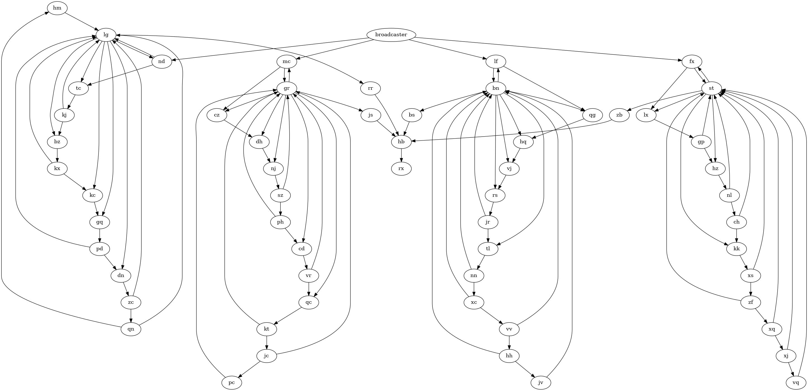

# Day 20

[Puzzle description.](https://adventofcode.com/2023/day/20)

Part 1 wasn't bad, but part 2 is where I got stuck and abandoned the AoC this year. Looking at it
nearly a year later, it was still hard.

The brute force approach (run the network until it a pulse is sent to `rx`) was far too slow.

My first instinct was that maybe the graph was a counter, so that `rx` input (`hb`) would count up
until they're all 1, but just trying to print the inputs wasn't working (though in retrospect, I
probably had a bug here).

I felt I probably needed to analyze the input, but I didn't want to do a bunch of work if that was
not the right way to go, so I looked for some hints, which told me that was the right thing to do.

I used `dot` to graph my input:

This shows clearly that there are 4 separate subgraphs, which output into nodes `rr`, `zb`, `bs`,
and `rr`, which are the inputs for `hb` which feeds into `rx`. So, we have to see how often each
of those four turns one individually.

Since this was pretty fast, I just did it by running the graph four times, rather than counting them
all in a single run. Once I have those four numbers, I needed their least common multiple, which
gave me the answer.

To use this program for any other input, you must substitute the names of the output nodes of each
subgraph.
